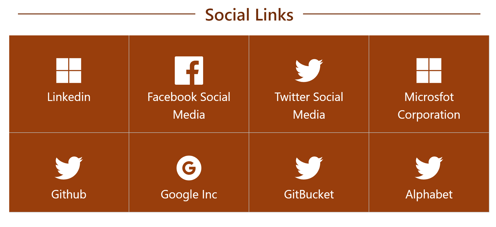
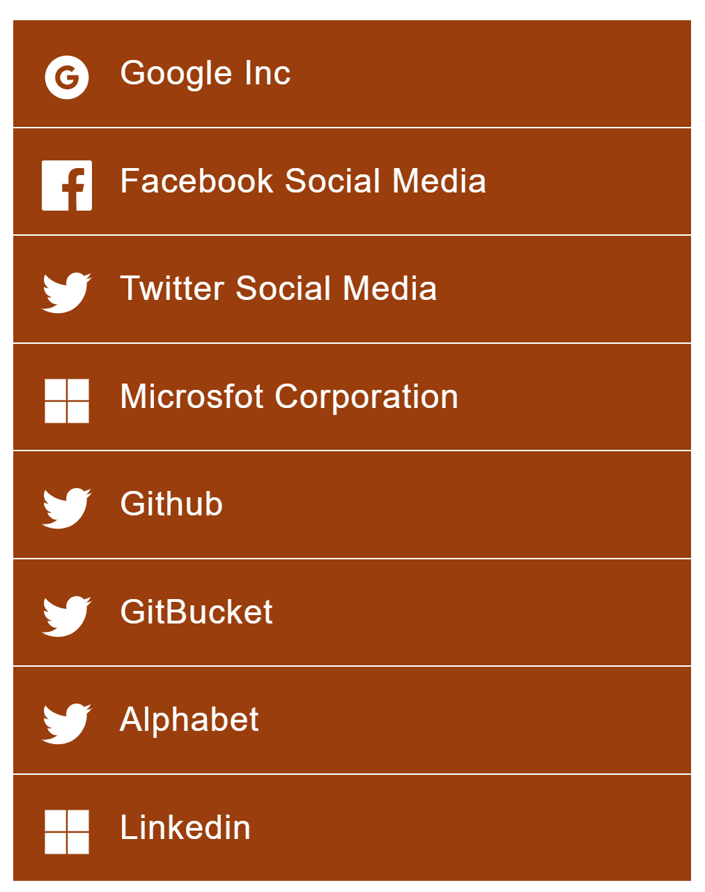

# List Tiles Webpart

This webpart allows to have three types of views from a list. All the views are sortable and can have a flag to show or hide the tiles. There are also optional properties that you can set like hyperlinks,texts and tooltips.

## Views in this webpart

### Top Three Tiles view
Allows you to show three tiles from your list on the top.
</img>

### Boxed Tiles view
Allows you to set tiles in a boxed view from items in your list with header as optional.
</img>

### Quick Links view
This view allows you to have all the tiles stacked up. 
</img> 

## Webpart Properties
From the property pane the mandatory fields are List and Icon. Below are the various properties and their use
#### List Title (Mandatory) 
    Title of the list to display the information from
#### Type of View (Mandatory) 
    Title of the list to display the information from
#### Icon (Mandatory)   [SharePoint Column Type: Single line] 
   Icon field is the base for this webpart. You need to select the column with icon name in it. You may grab the name of any icon from the ["React-Icons Repository"](https://react-icons.github.io/react-icons/). 
#### Title   [SharePoint Column Type: Single line] 
   Used as a hover text for the Top Three view and as a link text for Boxed and Quicklinks view
#### Tooltip   [SharePoint Column Type: Single line] 
   As the name says it is a tooltip text when you hover over the tiles.
#### Show/Hide flag   [SharePoint Column Type: Single line] 
   This column should have true/false value based on which the tiles either are shown or hidden.
#### Sort Order   [SharePoint Column Type: Number] 
   Column to sort the tiles based on how you need them to show (not how Sharepoint wants).
#### Hyperlink   [SharePoint Column Type: Single Line] 
   The link you want the users to navigate to upon clicking the tiles.

</img>

## Used SharePoint Framework Version

## Applies to

- [SharePoint Framework](https://aka.ms/spfx)
- [Microsoft 365 tenant](https://docs.microsoft.com/en-us/sharepoint/dev/spfx/set-up-your-developer-tenant)

## Version history

Version|Date|Comments
-------|----|--------
1.1|Apr 22, 2021|List Tiles Final release
1.0|Apr 15, 2021|List Tiles Initial release

## Disclaimer

**THIS CODE IS PROVIDED *AS IS* WITHOUT WARRANTY OF ANY KIND, EITHER EXPRESS OR IMPLIED, INCLUDING ANY IMPLIED WARRANTIES OF FITNESS FOR A PARTICULAR PURPOSE, MERCHANTABILITY, OR NON-INFRINGEMENT.**

---

## Minimal Path to Awesome

- Clone this repository
- Ensure that you are at the solution folder
- in the command-line run:
  - **npm install**
  - **gulp serve**

- Before you package the solution please update your CDN path. The current path points to my site.

## Useful Resources

- [React Icons](https://react-icons.github.io/react-icons/)
- [Getting started with SharePoint Framework](https://docs.microsoft.com/en-us/sharepoint/dev/spfx/set-up-your-developer-tenant)
- [Use Microsoft Graph in your solution](https://docs.microsoft.com/en-us/sharepoint/dev/spfx/web-parts/get-started/using-microsoft-graph-apis)
- [Publish SharePoint Framework applications to the Marketplace](https://docs.microsoft.com/en-us/sharepoint/dev/spfx/publish-to-marketplace-overview)
- [Microsoft 365 Patterns and Practices](https://aka.ms/m365pnp) - Guidance, tooling, samples and open-source controls for your Microsoft 365 development
